  

  
  
  

### 📂 projects/

| Project | What it is |
|---|---|
| 🟧 [RagLabs](#) | RAG agent · FastAPI + LangGraph |
| 🟦 [ThreadUp](https://github.com/DJ-Labcode/ThreadUp) | Flutter app |
| 🟩 [DSA Journey](https://github.com/DJ-Labcode/Data---Structures---Algothrims---Java--Python--C---) | Java · Python · C |
